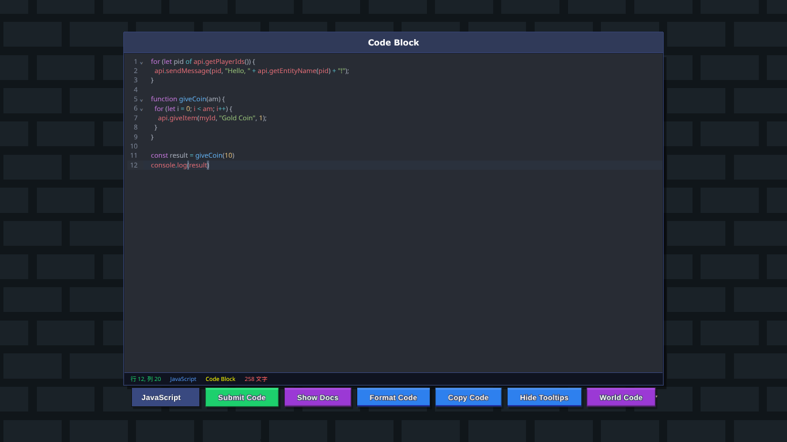

# Bloxd-Code-Editor
[Bloxd.io](https://bloxd.io)のゲーム内コードエディターをブラウザ上で再現した、高機能コードエディターです。\
[JavaScript モジュール](https://esm.sh)を活用し、実際の開発環境に近い操作感を提供します。\

- Table of Content
{:toc}

# 機能
- ハイライト機能
- 自動補完機能
- ツールチップ機能
- メインボタン

## ハイライト機能
コードを種類別にわけて色をつけ、視認性を高くする機能です。\
[JavaScript モジュール](https://esm.sh)のコードミラーを使用しています。
以下の配色は[言語](#言語選択)をJavaScriptに設定している場合の配色です。

|種類|色|役割の例|
|---|---|---|
|変数名・プロパティ|#e06c75|`const name`, `player.pos`|
|文字列|#98c379|`"Hello World"`|
|キーワード (async等)|#e5c07b|`async`, `await`|
|演算子|#56b6c2|`+`, `-`, `=`, `=>`|
|記号・括弧|#abb2bf|`()`, `{}`, `;`, `,`|
|制御構文・宣言|#c678dd|`if`, `else`, `function`, `let`|
|関数名|#61afef|`print()`, `addEvent()`|

※自分でもよくわかっていないので何かあったらIssues(問題)のほうにお願いします。

また、括弧などにカーソルを合わせると背景色がつき、もう片方の括弧にも背景色がつきます。これにより、複雑なコードでもどこで閉じているのかがわかるようになります。

## 自動補完機能
開き括弧などを入力すると、その後に閉じ括弧が自動で補完されます。これは\<html>などのタグを入力した場合にも適用されます。\
さらに、言語をJavaScriptに設定している場合のみ、JavaScriptに関するキーワードの文字の一部を入力した際、その文字が含まれるキーワードのリストが表示されます。\
これはapiも同じで、api関数名の一部を入力するとその文字が含まれるapi関数名のリストと説明が表示されます。（コールバックはワールドコード時のみ、表示されます。詳細は[World Code / Code Block](#World Code / Code Block)からご覧ください。）

## ツールチップ機能
これは、コード内の文字の検索機能を主としたものです。\
コード内にカーソルを入れた状態でCtrl+Fを押すことで表示されます。また、[Show Tooltips](#Hide Tooltips / Show Tooltips)ボタンで表示することもできます。\

### 検索
検索をするには、Findと書いてある入力欄に検索した語をいれると、その文字がハイライトされます。\
nextを押すと次の文字へ、previousを押すと一つ前の文字へ移動します。allは、よくわかっていませんが、すべてを選択してハイライトする機能だと思われます。\
match caseにチェックを入れると、大文字小文字が区別されます。\
regexpは、正規表現です。正規表現は、パターンが多すぎるので自分で調べてください。例えば、`^ab`でabから始まる文字を検索できるなどです。\
by word二チェックを入れると、語句として検索することができます。`ab`を検索に入れると、`ab-ab`や`ab ab`のabが検索に引っかかります。`abab`のabはどちらも引っかかりません。

### 置換
置換は、文字を置き換えることができる機能です。[検索](#検索)に置換したい元の文字を入れ、Replaceに置換後の文字を入れてください。\
そして、replaceを押すことで選択している場所を置換することができます。replace allを押すと検索に引っかかったすべての文字を置換することができます。

## メインボタン
メインボタンは、コード入力欄の下にあるボタンのことです。\
これを使用することで様々な事ができます。ボタンは、以下のものがあります。

- 言語選択（プルダウン）
- Submit Code
- Show Docs
- Format Code
- Copy Code
- Hide Tooltips / Show Tooltips
- World Code / Code Block

### 言語選択
これはボタンではなくプルダウンで、コードの[ハイライト](#ハイライト機能)に影響します。\
ここの言語を変更すると、コードの文字につけられた色が変化します。

### Submit Code
これは、コードをファイルに保存するボタンです。\
Bloxd.io内での実際の挙動は、コードブロックやワールドコード内に入力したものを保存して画面を閉じるというものです。\
ですが、このエディターは最初から画面が開かれた状態なので、ファイルに保存するという挙動にしました。

### Show Docs
これは、Bloxd公式のCode APIドキュメントを開くボタンです。\
これを押すと、[Bloxdy/code-api](https://github.com/Bloxdy/code-api)が開かれます。（外部のサイトです）\

### Format Code
これは、コードを自動でフォーマットしてくれるボタンです。\
[JavaScript　モジュール](https://esm.sh)のprettierを使用しています。\
各言語の記入方法にあわせてフォーマットしてくれます。\
さらに、コードの記入にエラーが有ると表示されます。

### Copy Code
これは、コード全文をコピーするボタンです。\
これはCtrl+AをしてCtrl+Cで全文コピーをするものと同じ挙動をします。\
なぜこれが必要かというと、Bloxd.ioゲーム内の挙動は、Ctrl+Aを押しても現在見えている範囲しか選択されないようになっているからです。

### Hide Tooltips / Show Tooltips
これは、ツールチップを非表示/表示にするボタンです。\
[自動補完機能](#自動補完機能)に含まれる、キーワードなどの一部を入力したときにリストが表示されるかどうかを選択します。\
ボタン名が`Hide Tooltips`になっていれば表示、`Show Tooltips`になっていれば非表示です。\
検索や置換ができる[ツールチップ](#ツールチップ機能)も表示・非表示されます。（これは手動で表示・非表示ができます。）

### World Code / Code Block
これは、ワールドコードとコードブロックを切り替えるボタンです。\
コードブロックとワールドコードの主な違いは、コールバックを使えるかどうか、です。\
これはエディター内の動作では、補完機能のみに影響しますが、Bloxd.ioゲーム内では、実際にコールバックは使用できません。\
Bloxd.ioゲーム内の実際の動作としては、コードブロックはクリックした場合、ワールドコードはワールド内の動作から動くというものです。\
現在のモードは、コードエディター下の行数などが書いてあるところに記載してあります。

----

# アップデートログ
※日付は日本時間（JST）です
|バージョン|日付|内容|詳細|種類|
|---|---|---|---|---|
|ver.0.1.0|2026/4/14|作成開始|`bloxd codeeditor`として作成を開始。ハイライトなどの主なエディター機能を搭載しました。|`作成`|
|ver.0.2.0|2026/4/14|外見の整形|背景をBloxdの背景と一致させたり、ボタンを整えたりしました。|`更新`|
|ver.0.3.0|2026/4/15|apiの補完|Bloxdのcode-apiドキュメントを元に、apiの補完を追加しました。|`更新`|
|ver.0.4.0|2026/4/16|apiの補完の引数・説明|apiの補完に引数とapiの説明を追加しました。|`更新`|
|ver.0.5.0|2026/4/16|複数の機能を修正・追加|apiの補完機能、ワールドコードとコードブロックの切り替えの追加、表示メッセージの形式変更などです。|`更新`|
|ver.0.6.0|2026/4/17|apiの補完の整形|apiの補完内に引数などで改行されるように修正しました。|`更新`|
|ver.0.6.1|2026/4/17|apiの補完の整形の修正|補完内では改行されたものの、カッコ内での説明が適用されなかったものを修正しました。|`更新`|
|ver.1.0.0|2026/4/18|公開|`Bloxd Code Editor`を公開しました。|`公開`|
